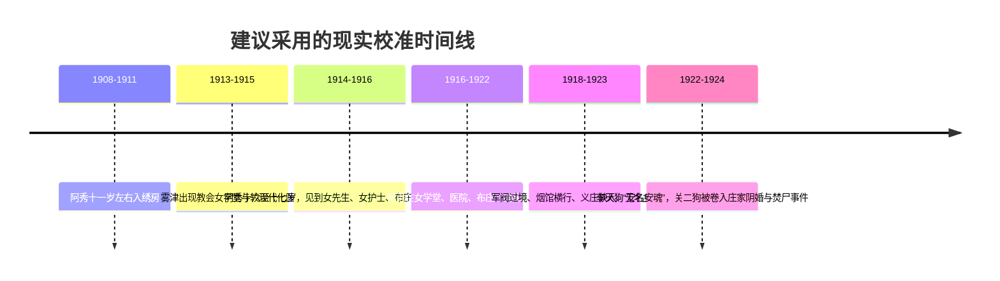
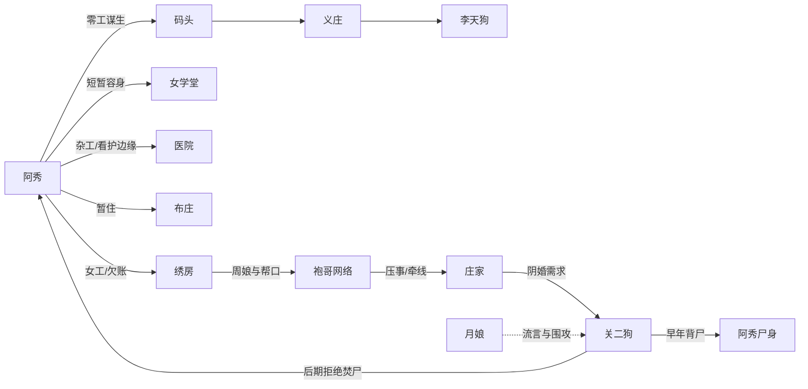

# 清末民初背景核验报告

## 执行摘要

两稿对川江港埠、袍哥、女工、阴婚与底层流动的社会气味把握较准；最大问题不在“旧中国味道”不足，而在年代锚点混杂。若把阿秀线校准为晚清末至民国前期、把关二狗线校准到军阀初期，再统一术语、币制与殡葬细节，整体可信度会明显提升。 fileciteturn0file0 fileciteturn0file1 citeturn9search1turn14search4turn17search3turn19search3turn28search3turn36search4turn34search0

## 调研边界与合理假设

本报告只核验**可历史验证的社会背景、制度、物质文化与人物生存条件**。凡剧本中的灵异现象，如“尸问其名”“安魂后异象消失”等，不判断其“真假”，只判断它们作为清末民初民间信念、行业叙述和地方社会接受度是否成立。由于剧本未明示具体省份、年份、教派、行政层级与币制，我采用一个最能解释文本细节的现实校准框架：**“雾津/桃溪”主要参考川东—重庆—万县式上游江港社会；阿秀的成长线从晚清末延伸到民初，关二狗主线落在军阀期早段最稳妥。** 判断依据是文本同时出现了袍哥、抄手、码头、女学堂、女护士、军阀过境、“官话/国语过渡”和“白面”等线索；而袍哥主要活跃于四川及周边，女子学堂在清廷于1907年正式开禁后迅速扩张，国语体制化发生在1912年后，军阀时代则通常界定在1916年至1928年之间。fileciteturn0file0 fileciteturn0file1 citeturn9search1turn17search0turn17search3turn19search3turn28search2turn28search3turn36search4

下表列出**剧本中未明确说明、但对年代和地域判断极关键**的要素。这些不是“缺点”，但如果不补，会让很多本来准确的细节互相顶撞。下表“当前状态”均据两份剧本文本整理。 fileciteturn0file0 fileciteturn0file1

| 未指明项 | 当前状态 | 为什么重要 | 建议补法 |
|---|---|---|---|
| 具体年份 | 未指明 | 决定“短发女先生”“女护士”“军阀”“白面”能否并存 | 直接落一句年代锚，如“宣统三年”“民国十一年秋” |
| 省份与区域原型 | 未指明 | 决定袍哥、抄手、码头、方言与丧葬细节是否匹配 | 明示“川东上游某江港”“川东某商埠” |
| 城市等级 | 未指明 | 决定女学堂、医院、善堂、烟馆、堂子是否能同时出现 | 说明雾津是“府城/商埠/大县城”之一 |
| 女学堂与医院性质 | 未指明 | 不同于“官立、教会、慈善、商埠医院” | 设定为“教会女学堂+附设医院”最省改动 |
| 负责收尸与停尸的机构 | 未指明 | 义庄、善堂、城隍庙、警署停尸房的逻辑不同 | 四选一，不要混用；最推荐“义庄/善堂”为主 |
| 币制 | 未指明 | 关系到“两三个铜板”是否合理 | 统一成“文/铜元/大洋”三层体系 |
| 女性身体状态 | 未指明 | 是否缠足、是否放足会直接影响阿秀的逃亡和码头生计 | 至少说明阿秀、招娣、小翠是“天足/半放足/缠足”哪一种 |
| 官署与治安机构 | 未指明 | 关系到无名女尸、拐卖、军阀骚扰为何无人过问 | 加一两笔“巡警、保甲、善堂、码头帮口”即可 |

## 历史设定核验总表

下表中的“剧本设定”均据《阿秀的故事》《关二狗的故事》整理。 fileciteturn0file0 fileciteturn0file1

| 类别 | 剧本设定 | 历史评估 | 修改建议 | 优先参考来源 |
|---|---|---|---|---|
| 时间框架 | 阿秀线同时出现绣房、女学堂、女护士、码头、军阀；关二狗线又出现“白面”“印子钱”“堂子” | **部分符合。** 单项大多都能成立，但放在同一时间点会把年代从1907后女学开禁，一路拉到1916后军阀期，再逼近1920年代城市毒品语汇。 citeturn9search1turn17search3turn19search3turn34search0 | 最稳妥是把阿秀11岁入绣房定在1908—1911，关二狗主线定在1922前后；若坚持更“清末”，需删改“短发女先生”“白面”等。 | 《学部奏定女子小学堂章程》；《教育部公报》；四川军阀史料；近代毒品史 |
| 地域原型 | 雾津、桃溪、抄手、袍哥、码头、江中捞尸 | **部分符合。** 整体强烈指向川东/重庆—万县式上游江港社会；若不是西南，袍哥与“抄手”的地域味就会偏。 citeturn28search2turn28search3turn36search4 | 直接写成“川东上游一带的商埠小城”，或让人物口中出现一处真实上位地名，如“往重庆去的船”“从万县下来的货”。 | 《巴县志》；《重庆市志》；《四川省志》；袍哥研究 |
| 绣房格局 | “前头店面，后头工房”，常驻女工十余人，女掌柜管账管人 | **符合。** 手工业作坊前店后作、家内生产与雇工并存，没有明显时代硬伤；蜀绣、蜀锦传统也让西南绣房很容易成立。 citeturn41search3 | 可补一两笔“来样、订活、交期、押钱”，让经营结构更真实。 | 地方工艺志；商业志；妇女劳动史论文 |
| 家贫送女出门 | “家里六口人，饭只够五口吃，所以是她走” | **符合。** 晚清民初贫家出女、卖婢、学徒、寄养、配人都很常见，尤其灾荒与城市化加剧后更明显。 citeturn32search4 | 可补“不是卖断，是顶账/抵吃穿”这类半遮半掩的话，更贴近底层家庭语气。 | 《申报》灾荒与卖人报道；地方社会史；善堂档案 |
| 买来的姑娘与“配人” | 小翠可能被买来，后又“要配人”；关二狗也替人送“会哭的包袱” | **符合。** 买卖妇女、童养、转卖、配婚在清末民初都是真问题；文本写法偏含蓄，但方向对。 citeturn32search4turn30search2turn19search0 | 不必直白讲“拐卖”；一张身契、一句“牙子带来的”、一笔“尾款”就够。 | 当代报刊拐卖新闻；地方民政志；人口贩卖研究 |
| 白活与夜活 | 嫁衣、喜帐、寿帐、寿衣、丧帐并做 | **符合。** 婚丧衣制与针线活在同一作坊合并承接很自然，也有利于强化阿秀“摸布识人”的职业经验。 | 可明确“白活接外头主顾，夜活多是赶急的丧事活”，增强业务逻辑。 | 丧葬礼俗志；地方手工业志 |
| 扣工钱、记账、体罚 | 绣坏缎子扣三个月，另算针线费、住宿费、医生钱，管事用尺责罚 | **基本符合，落点已修正。** 师徒制、债务化雇佣、体罚在近代作坊并不稀奇；但“打手心”是私塾学堂的体罚符号，且绣娘的手是作坊的核心生产工具，精于算账的周娘绝不会去毁自己财产最值钱的部件（手、脸）——故体罚改落在背、肩、腿等不伤手脸的位置，核心罚则仍是扣工钱、记账、罚粗活。 | 建议把“账”具体化：加一笔“账本上记着她的名”和“每月只给一点活钱”。 | 地方商业志；作坊劳动史；近代工读制度研究 |
| 日常器物与饮食 | 线头用口抿、红油抄手、红油纸伞、香粉盒、洋字烟盒纸 | **大体符合。** 这些器物都能落进晚清民初城市日常；“洋字烟盒纸”尤其会把年代往通商后、卷烟包装普及后推。 citeturn29search0turn28search2 | 若要更晚清，可把“烟盒纸”写成“洋烟纸壳”；若要更民初，则保留现状即可。 | 地方风俗志；物质文化史；近代卷烟史 |
| 女学堂 | “洋人办的女子学堂”，向绣房订校服和袖章 | **符合。** 女子学堂在1907后合法化，教会女学更早就存在；教会学校订制服、徽章也说得通。 citeturn9search1turn32search4 | 补一句“教会/美以美会/天主堂女学堂”的性质，学校就立住了。 | 《学部奏定女子小学堂章程》；《申报》女学新闻；地方教育志 |
| 女先生的形象 | 穿洋装、短发、自己谈价、讲一口听不太懂的官话 | **部分符合。** “会谈价、会出门办事”的女教员很成立；但“短发+洋装”更接近1911后，尤其是1910年代至1920年前后的新女性形象。 “官话”作为口语没问题，但若是学校课程名，更晚期会写“国语”。 citeturn29search5turn29search0turn17search0turn17search3 | 若定1912后，可保留短发洋装；若定1907—1911，改成盘发、文明新装或大襟衫裙，称“女教习/女先生”更稳。 | 《教育部公报》；国语运动史；女学生服饰与剪发报刊 |
| 女护士与医院 | 医院女护士来订围裙和白布帽；阿秀后来去医院洗布、缝围裙、跑腿 | **部分符合。** 近代中国职业护理在20世纪初已成形，1909年已有全国性护士组织；但内地小港城能否出现女护士，取决于它是不是教会医院、商埠医院或较大的慈善医院。 citeturn14search4turn23view0 | 最好定成“教会医院”或“商埠慈善医院”；“女护士”可加一句“受过训练的看护”。 | 中华护理学会史；北京协和医学院护理史；地方医院志 |
| 女性经营者 | 寡妇开的布庄、女护士、女先生都能独立谈事 | **符合。** 清末民初新式女教育与城市服务业的确打开了一部分女性职业空间，尤其教会学校、医院、寡妇自营小店。 citeturn15search0turn4search0 | 建议给布庄寡妇加一点背景，如“先夫死后她接手铺子”，让身份更稳。 | 近代女性职业史；地方工商志；妇女研究论文 |
| 保人与夜识字班 | “没有保人，留不住你”；“夜里的识字班，学认账、认数字” | **部分符合。** 保人与推荐网络在近代城市确实重要；夜间识字与实用识数更像1910年代后、民初城市慈善或新式教育扩张的产物。 citeturn17search3turn40search6 | 可把“保人”具体成“教会保人”“铺保”“牙保”；识字班可加“夜学”“义学”“妇女识字班”称法。 | 地方教育志；慈善教育史；城市社会史 |
| 码头边生计 | 洗碗换饭、草棚夜宿、替船工补包袱、替码头布行改旧衣 | **符合。** 这是非常可靠的底层港埠生计链条，尤其适合上游江港。 citeturn28search2turn28search3 | 可补“脚夫、挑夫、船帮、平码头”的口语，两三处就能更鲜活。 | 港口史；码头工人史；地方商业志 |
| 工价和币制 | “一件活两三个铜板，有时做两三天才够买米” | **部分符合。** 问题不在贫，而在单位不明：晚清民初小钱可能是“文”“制钱”“铜元”，其购买力差很大。币制不锚定，观众很难判断贫困程度。 citeturn17search1turn17search4 | 统一写法：小额用“十几文/几十文”或“几枚铜元”，大额用“银毫/大洋”。 | 近代货币史；地方财政志；《中国钱币》论文 |
| 烟馆与鸦片 | 码头边有烟馆，阿秀替抽大烟的人补衣 | **符合。** 川江流域军阀时期烟政与烟馆都很普遍，四川尤其与鸦片税政深度纠缠。 citeturn28search3 | 可把“抽鸦片的”再区分为“老烟枪”“抽烟土的”，更有地方感。 | 四川烟政史；地方警政志；报刊烟禁报道 |
| 军阀过境 | 一个营在码头待两天，街上女人三天不敢出门 | **符合。** 这类女性避兵、商门闭户、士兵扰民，确实是军阀期城市经验。 citeturn19search3turn28search3 | 建议加一条街面痕迹：贴告示、抽丁、收捐、驻扎某营旗号。 | 四川军阀史；地方志“兵事”“民变”卷 |
| 义庄与收尸 | 义庄常年缺人手缝寿衣；江里有无名女尸；城隍庙又曾停无名女尸 | **部分符合。** 义庄、善堂、义冢、掩埋队都是真实制度；但“义庄”“城隍庙”“收殓处”若并用，会显得机构体系混乱。 citeturn32search1 | 三选一并统一：最推荐“义庄/善堂掩埋队”；若用城隍庙，最好说明只是“暂厝偏殿”。 | 地方民政志；善堂史；义庄档案 |
| 袍哥介入地方事务 | 袍哥管事请人“压事”；周娘亡夫也在袍哥里 | **符合。** 袍哥在四川及周边不仅是秘密帮会，也嵌入码头、商埠、暴力保护与灰色调停网络。 citeturn36search4turn38search3 | 可给“管事”更具体的身份：堂口、码头头人、茶房老大，避免一概写成抽象黑社会。 | 袍哥档案；四川社会史；地方警务志 |
| 阴婚 | 庄家小儿子死后，要给他配一具女尸，且“照样能谈价” | **符合。** 冥婚在近代中国并未绝迹，对尸体、纸婚、牌位、聘财都有现实基础；但不同地区浓度差异大，北方更常见，西南要补一点“为什么这里也要这样做”的家族逻辑。 citeturn19search0 | 给庄家一句动机：为续香火、安魂、完婚、免“孤坟无偶”等。 | 《申报》《大公报》阴婚新闻；地方风俗志；冥婚研究 |
| 月娘式女性污名 | “不嫁人就是有问题”“血衣”“阴门生意” | **大体符合。** 底层社会对未婚、寡居、做针线或涉阴事的女性常有污名化叙事；这类流言很像近代城市里对“异类”女性的社会处理。 fileciteturn0file1 | 若要更历史化，可让人群骂她“晦气”“招秽”“冲犯”，比抽象“有问题”更贴近旧口语。 | 地方风俗志；女性污名与民俗研究；当代报刊异闻 |
| 李天狗与“四柱纯阴” | 李天狗替无名女尸“安名安魂”；认出阿秀“四柱纯阴” | **符合。** 四柱命理、阴魂安名、民间法师/阴阳先生处理无主尸体，都在旧社会想象和实践范围内。 citeturn19search0turn39search3 | 建议明确李天狗是“阴阳先生”“端公”“法师”还是“道士”，不要让职业标签漂。 | 命理书、地方礼俗志、地方宗教志 |
| 尸衣后换与改名牌 | 尸体衣服被后换，牌子上名字“刮了又写，写了又刮” | **部分符合。** “后换衣”“掩真名”与买卖妇女、冥婚、收尸流程都能解释；但“行货流转牌”的物流感较强，略像现代货签。 citeturn19search0turn32search1turn32search4 | 建议把“牌子”具体化成“棺签、号牌、身契折角、义庄号签”之一，会更旧，也更狠。 | 善堂收殓簿；卖身契文书；地方民政档案 |
| 假道士经济 | 旧道袍、桃木剑、画符、合八字、择吉、说书蹭名头 | **符合。** 旧社会底层“半仙”“先生”“假道士”混饭非常合理；尤其茶馆说书与江湖名号互相喂养，十分成立。 citeturn19search0turn32search1 | 词汇上别总写“道士”；可用“先生”“画符的”“看宅的”“阴阳的”，更像民间社会。 | 报刊江湖人物报道；民间宗教志；地方庙会资料 |
| 合八字为买卖婚姻背书 | 给被“带来”的年轻女孩择“宜嫁娶”吉日，给交易披体面外衣 | **符合。** 这是把婚配、命理与买卖妇女连起来的典型旧社会操作。 citeturn19search0turn32search4 | 可以加一句“拿红纸写了吉帖”或“媒婆收起日子单”，更具物证感。 | 婚俗志；拐卖妇女报刊；地方司法档案 |
| 乞丐组织与“丐帮” | 小叫花“有帮”，关二狗被“丐帮”围殴 | **部分符合。** 乞丐有地盘、有头目、有门户，完全说得通；但“丐帮”一词武侠色太重，会把语感拖离近代社会史。 | 建议改成“花子头的人”“这一片讨口的有头儿”“叫花子一伙的”。 | 地方治安志；城市边缘群体史；乞丐管理史 |
| “白面” | 老混子“扎上了白面”，骨瘦如柴 | **部分符合。** 若“白面”指海洛因/吗啡类白色毒品，它在药物史上属于1898年后才可能出现的现代毒品语汇，且更贴近1910年代末到1920年代后的城市口语；若定更早，则不稳。 citeturn34search0turn28search3 | 若时间定1920年代，可保留；若更早，改成“打吗啡针”或干脆改为“老烟枪抽大烟抽垮了”。 | 近代毒品史；四川烟政史；地方警察志 |
| 印子钱 | 关二狗借“印子钱”，利滚利“驴打滚” | **大体符合。** 高利贷在近代城乡极普遍；“子金”与滚利环境在四川商业社会并不陌生。 citeturn37search3 | 可再加一句更旧的俗语，如“九出十三归”或“月底翻本”。 | 地方金融志；民间借贷研究；报刊讼案 |
| 堂子、烟馆与“二爷” | 袍哥把他拉进堂子、烟馆，被姑娘称“二爷” | **符合。** 堂子/烟馆/帮口饭局是典型旧城市权力展示空间。 citeturn28search3turn36search4 | 若要更西南，可加“茶房”“堂口”“码头上头人”一类称呼。 | 地方风月史；警政志；袍哥资料 |
| 城隍庙停尸与清明焚棺 | 城隍庙偏殿守尸；结尾雨夜烧棺送走阿秀 | **部分符合。** 庙宇暂厝、看尸可成立；但对汉人主流丧葬而言，**土葬仍是主流**，若把“焚棺”写成一种正常而体面的送葬，就会偏离多数地方习惯。若它是“避追查、毁证、非常处置”，则能成立。 citeturn32search1turn39search0 | 若想更历史真实：改为“雨夜薄葬/掩埋+烧纸”；若必须保留焚棺，就要让人物明确知道这在犯忌，是不得已。 | 地方殡葬志；善堂史；《中国殡葬史》 |
| 语言用法 | “官话”“袍哥”“二爷”“抄手”等 | **部分符合。** “袍哥”“二爷”“抄手”都很稳；“官话”作日常称呼也对。但若是学校正式课程名，民初会越来越多改称“国语”。 citeturn17search0turn17search3turn36search4 | 可把女先生的话改成“讲一口官话，夹着新学堂里头说的国语词儿”，兼顾过渡感。 | 近代语言史；地方方言志；教育史 |

## 人物背景核验总表

下表聚焦主要人物的**身份、阶层、职业、教育、出身、语言能力、社会关系、经济状况与政治立场**。未在剧本中明确的项目，均标注“未指明”。两表依据仍为两份剧本文本。 fileciteturn0file0 fileciteturn0file1

| 人物 | 剧本中的人物背景 | 历史评估 | 建议补充或修订 | 优先参考来源 |
|---|---|---|---|---|
| 阿秀 | 贫家女，十一岁入绣房；底层女工；后为流动针线工、医院杂工、码头零工；教育极低，后学认账认数字；政治立场未指明 | **符合。** 她几乎是晚清民初底层城市女性最窄的一条生路：作坊—婚配—慈善/教会边缘工作—码头。 citeturn9search1turn32search4turn14search4 | 必补两点：一是她是否缠足；二是她识字到什么程度。只要这两点补上，人物会更历史化。 | 妇女劳动史；女学史；地方风俗志 |
| 周娘 | 寡妇，接手亡夫留下的绣房；有袍哥关系；掌账、掌婚配、掌出货 | **符合。** 这种依靠亡夫社会网络存活的寡妇经营者，在旧城市里非常可信。 citeturn36search4 | 建议说明她是“守寡不改嫁”还是“名义寡妇、实有帮口撑腰”，后者更有旧城现实感。 | 地方工商志；袍哥研究；妇女社会史 |
| 招娣 | 较年长的绣房姑娘，被“许人”带走；具体去向不明 | **符合。** 她是典型“作坊女工—婚配/转卖”的过渡型人物。 | 可加一句她的足、口音或原籍，使她不只是功能人物。 | 作坊劳动史；婚俗志 |
| 小翠 | 更年轻、可能被买来的女孩，后来“配人”失踪 | **符合。** 与买卖少女、转手婚配高度贴合。 citeturn32search4turn19search0 | 建议给她留一个更具体的“被带走标志”，如牙婆、身契角、红绳记号。 | 人口贩卖研究；报刊个案 |
| 女先生 | 教会女学堂来人；洋装、短发、会谈价；大概率受新式教育；宗教身份未指明 | **部分符合。** 形象成立，但强烈要求时间点落在1912后。 citeturn9search1turn29search5turn17search3 | 最好明确她是“中国籍女教员，教会学校出身”，而不是模糊的“洋女先生”。 | 女学史；教会学校史 |
| 女护士 | 医院下单者；职业女性；训练程度未指明；可能属于教会/慈善医院 | **部分符合。** 若是较大商埠或教会医院，非常成立。 citeturn14search4turn23view0 | 加“见习护士/看护”还是“正式护士”的差别；还可补一句医院性质。 | 中华护理学会史；医院志 |
| 李天狗 | 流动民间术士，擅“安名安魂”；社会地位不低；教育程度未指明；政治立场未指明 | **符合。** 这类人在旧社会常处于“被敬又被疑”的夹层位置。 | 必须明确定性：阴阳先生、端公、法师、道士四者选一，不要全占。 | 地方宗教志；礼俗志；民间法师研究 |
| 关二狗 | 都市最底层男性，无父母、无帮口、长期杂工；半文盲或几乎不识字；靠观察力和嘴皮子混饭；政治立场未指明 | **符合。** 这是非常稳的城市边缘人口画像。 citeturn36search4turn19search3turn28search3 | 建议增加一个“旧伤或旧病”，让他“底层身体史”更具体；还可明确他是否会写自己名字。 | 城市贫民史；码头劳工史；帮会社会史 |
| 庄家、周先生 | 至少是地方绅商或富户；有能力办阴婚、雇人、请关系；政治立场未指明 | **符合。** 但“庄家”到底是绅、商、地主还是码头富户，目前不清。 | 选一种，不要虚空富。最推荐“码头绅商/盐商关联户”之类。 | 地方名录；工商志；家族史料 |
| 月娘 | 只在关二狗线被传闻化呈现：未婚或异类女性，与“血衣”“做法”“阴门生意”连在一起；出身、职业、教育未指明 | **部分符合。** 流言机制非常对，但她现在更像“功能性符号”，不够历史具体。 | 若月娘在总故事里重要，建议补她的职业、原籍、婚姻状态和与街坊的经济关系。 | 女性污名研究；地方异闻报道 |
| 袍哥管事 | 地方灰色秩序中介，能调人、压事、拉关系 | **符合。** 尤其放在四川语境内很稳。 citeturn36search4turn38search3 | 给一个具体称呼，如“某码头团总”“某堂口管事”，能立刻落地。 | 袍哥档案；地方治安志 |

## 建议时间线与人物关系图

下面的时间线不是剧本现有“明示年份”，而是**为了兼容你已经写出的女学堂、女护士、军阀、阴婚、码头、白面等元素而提出的最省改动校准方案**。女子学堂在1907年后进入合法扩张期，国语制度化发生在1912年后，四川军阀混战则主要落在1916年至1928年。 citeturn9search1turn17search3turn19search3turn28search3

下图是按现有文本重建的**剧情关系图**，目的是帮助你在修改时判断哪些历史设定需要“共用一套制度解释”。比如：阿秀被“账簿/身分/保人”困住，关二狗则被“册子/帮口/名号”困住；这两条线其实共享同一个社会机制。 fileciteturn0file0 fileciteturn0file1

## 主题、人物弧线与历史意涵

两稿最强、也最有历史质感的地方，不是某一件器物写得多旧，而是你抓住了**“旧社会里，一个人有没有名字、名字写在哪本簿子上、由谁替她/他作保”**这一制度性问题。阿秀线里有绣房账、媒人眼、校服袖章、医院白布、义庄号牌；关二狗线里有袍哥册子、说书口碑、假道士名号、堂子里的面子。换句话说，这两个故事都在写：晚清民初的人，并不是先以“公民”存在，而是先以**家族成员、作坊人、帮口边角料、善堂无名尸、可被配婚的女身、可被借名行事的江湖人**而存在。这一点非常贴近晚清民初社会秩序碎片化、互不统一的现实：旧式宗族、秘密社会、教会学校、医院、善堂、码头经济与新式语言教育并存，人的身份经常依附于这些具体机构，而不是依附于一个统一、平等、现代的国家社会。 fileciteturn0file0 fileciteturn0file1 citeturn17search3turn32search1turn36search4

阿秀的弧线尤其好，因为她不是后来作品里那种“觉醒后立刻掌握现代话语的女主”，而是一个更符合历史经验的底层女性：她首先掌握的是**手艺、目力、触感、识布识针脚的职业判断**，而不是政治口号；她看到女先生、女护士、寡妇布庄主时，也不是立刻神往，而是先被震住、再感到距离。这很真实。1907年后女学合法化、1910年代后职业女性空间扩张，这些变化的确发生了；但对像阿秀这种出身的人来说，看到现代性与真正进入现代性之间仍隔着保人、住处、推荐链、识字能力与脚力。你的文本正是写出了这种“看得见，够不着”的断裂。若再补一笔她是否缠足、是否天足，人物就会从“文学上可信”进一步变成“社会史上扎实”，因为她后来的逃跑、码头谋生、夜里赶路，都与这件事直接相关。 fileciteturn0file0 citeturn9search1turn29search2turn32search4

关二狗的弧线也很强，强在它不是“受教育—懂正义—去救人”的现代成长，而是一个军阀期城市边缘男性，在灰色秩序里被踩久了以后，仅凭一点点迟到、细小、几乎说不出口的恻隐之心，终于在最后一刻手伸不出去。这种写法，比很多直接喊口号的民国戏更像那个时代。因为军阀期西南城市里，底层男性往往真就是在零工、帮口、烟馆、堂子、债务、流言与半江湖职业之间活着，既不是革命主体，也不是现代法权主体，更多时候只是被人借用、被人扔掉的活动零件。关二狗从“没本事的人”“靠嘴活的人”变成最后那个“至少没有把火点下去的人”，他的成长不是变成英雄，而是终于承认自己也是会被他人之死碰到的一块肉身。这种“负伦理”的人物转折，反而非常接近晚清民初底层社会的真实心理：不是先有宏大理念，而是先有迟疑、怕、羞、过不去，然后才勉强做出一点点不像自己会做的事。 fileciteturn0file1 citeturn19search3turn28search3turn36search4

两稿合起来看，最有历史意涵的核心意象其实是**“女人如何被改名、改装、改账、改用途”**。小翠被“配人”，阿秀被瞒命格、疑似要被“安排”出去，庄家给死人配婚，女尸被换衣、重写牌子，月娘被流言塑形，关二狗甚至不自知地替“带人”生意跑过腿。冥婚在这里不是单纯的猎奇民俗，而是对近代中国一类极真实社会逻辑的放大：女性身体会在婚配、买卖、作坊劳动、慈善收殓、流言与信仰中反复转手，仿佛既是人，又被迫成为一种可流转物。历史上，冥婚、卖身、拐卖、善堂收尸、无名女尸等本就相互勾连，只是现实不一定像戏里这样集中爆发；但你把它们压缩到同一条叙事链里，反而把“旧社会如何吞没一个底层女性”的结构说清楚了。问题只在于：现在这条链条略偏“象征”，尚欠一两个更硬的现实节点。只要补上一张身契、一张棺签、一条义庄收殓簿、或者一个警署不肯多管的细节，这个主题就会从“纯民俗惊悚”进化成“真正有社会史重量的民国黑暗寓言”。 fileciteturn0file0 fileciteturn0file1 citeturn19search0turn32search1turn32search4

总体评价是：**历史气味已成，制度骨架还可再硬一点。** 你写得最好的并非器物考据，而是阶层关系、羞耻感、被看不起的身体经验、女性在旧秩序中的可替代性，以及“名字”如何成为人生存与死后归处的最后一层政治。若按本报告的建议把年代、地域、机构和术语再扣紧，这两稿完全可以从“有民俗风格的架空旧中国故事”，提升成“扎在清末民初社会肌理上的叙事”。 fileciteturn0file0 fileciteturn0file1 citeturn9search1turn14search4turn17search3turn19search3turn36search4turn39search0

## 可执行修改清单

基于上面的核验，最省改动也最有效的修改，不是大改剧情，而是把**时间、地点、制度解释与术语**统一起来。下面这份清单按执行优先级排列。前两项做完，整体可信度会立刻上一个台阶。 citeturn9search1turn17search3turn19search3turn28search3turn36search4turn39search0

1. **先选定一条年代路线，不要再混写。**  
   最推荐的是：阿秀入绣房在1908—1911，关二狗主线在1922前后。这样女学堂、短发女先生、女护士、军阀、袍哥、烟馆、印子钱、白面都能共存。  
   备选路线是强化“清末味”：把主线压到1907—1912，这样就必须删改短发洋装、把“白面”改成“大烟/吗啡针”、把“军阀”改成“巡防营/新军/乱兵”。

2. **明确“雾津”的现实原型就是川东上游江港。**  
   只加三四处实词即可，比如“川东”“上游”“往重庆去的船”“从万县下来的货”。一旦地理锚点落地，袍哥、抄手、码头、江中捞尸、烟馆的可信度会全部上升。

3. **把女学堂和医院改成同一套机构链。**  
   最省事的版本是：“城北教会女学堂”和“教会附设医院”。这样女先生、女护士、阿秀暂住、保人不足、识字班，都自然串起来，不必每一处单独解释。

4. **把“女先生”做成中国籍新式女教员，而不是抽象‘洋人气的女人’。**  
   保留她的短发、洋装、会谈价、讲官话都可以，但给她一句来历：例如“教会学校出来的”“在省城念过堂学”。这能把她从符号变成时代人物。

5. **统一币制。**  
   小钱统一写“文/铜元”，稍大写“银毫”，大钱写“大洋”。  
   例如：  
   - 一碗抄手：几文到一二十文  
   - 补一件旧衣：十几文到几十文  
   - 跑腿一次：几枚铜元  
   你不必写精确物价表，但一定要让观众知道“铜板”究竟是什么单位。

6. **重写“无名女尸”的制度流程，只需补两三句。**  
   推荐改成：  
   “江里捞起尸——善堂/义庄来抬——挂号牌——等认领——无人认领则入义冢或被人另作他用。”  
   这样李天狗的“安名”、阿秀的“拆衣”、庄家的“买尸/配尸”就不会像悬空民俗，而会像沿着一条真实制度缝隙发生。

7. **把“牌子反复刮名”改得更旧。**  
   现在“行货流转牌”略有现代物流感。  
   更好的写法是：  
   - “义庄号签”  
   - “棺签”  
   - “牙帖角”  
   - “身契折角上旧墨未净”  
   你甚至可以让阿秀一眼认出某种绣房内部记号或某种布庄惯用号码，比“刮了又写”更惊人，也更历史化。

8. **给阿秀补一个身体史细节。**  
   最重要的是她是否缠足。  
   - 若她天足：她能更顺畅地出走、赶路、码头做活。  
   - 若她曾缠足后放足：她的疼、走路慢、冬天脚病、难找活都会更具体。  
   这是决定人物行动逻辑的关键设定，最好补。

9. **把“丐帮”换成更近代城市口语的说法。**  
   建议改成“花子头的人”“这一片讨口的有头儿”“叫花子那一伙”。  
   这样既保留组织感，又去掉武侠味。

10. **处理好“白面”这个年代指示器。**  
   如果你采用推荐时间线到1920年代，就保留“白面”，甚至可写成“打吗啡针、沾了白面”；  
   如果你想更早，就把这句改成“大烟抽垮了”。  
   不要让一个词把整部戏意外推迟十几年。

11. **把“保人”具体化。**  
   “没有保人，留不住你”很好，但还可以更狠一点：  
   - “没有铺保”  
   - “没有教会里头的人替你担着”  
   - “没有熟人写名，我不敢留你”  
   一落地，就会更像旧社会。

12. **把关二狗的“假道士”路线改成“民间先生”路线，会更稳。**  
   除非你明确他穿的是旧道袍扮相，否则建议少用“道士”这个硬标签，多用“先生”“画符的”“看宅的”“阴阳的”。  
   这样他向乡下人混饭吃的路子，会比“真正出家道士”更可信。

13. **结尾的“焚棺”要么改成“薄葬”，要么明确它是犯忌。**  
   如果这是阿秀的“好好送走”，那就不如“埋在旧庙后头，烧纸，点香，说错词，雨里填土”；  
   如果你坚持火烧的视觉效果，就让关二狗知道自己在做一件不合正礼、但不得不做的事。观众会更信。

14. **给庄家一个可识别的社会身份。**  
   只要一句：  
   - “做盐号的庄家”  
   - “码头上有船的庄家”  
   - “商会里有头脸的庄家”  
   阴婚、请人、压事、拉袍哥，就全有根。

15. **若月娘在总故事里重要，务必补出身与职业。**  
   她现在是很好的“被流言杀死的人”，但还不是完整的时代人物。给她补“寡居/未婚”“靠什么吃饭”“为何与血衣、做法、阴门生意扯上关系”，她就会立刻重很多。

16. **把“名字”母题再往前埋一层。**  
   现在结尾很好，但前面还可以再加三处轻伏笔：  
   - 绣房账本里只记阿秀的工，不记她的痛；  
   - 关二狗不在袍哥册上，所以什么都不是；  
   - 义庄号牌上的名字可抹去。  
   这样最后“安名/焚名/救名”的结构，会更完整。

如果只允许你先做三件事，我建议优先做这三件：**锁定年份、锁定地域、统一收尸机构**。这三件一完成，其他细节基本都会自己长对地方。