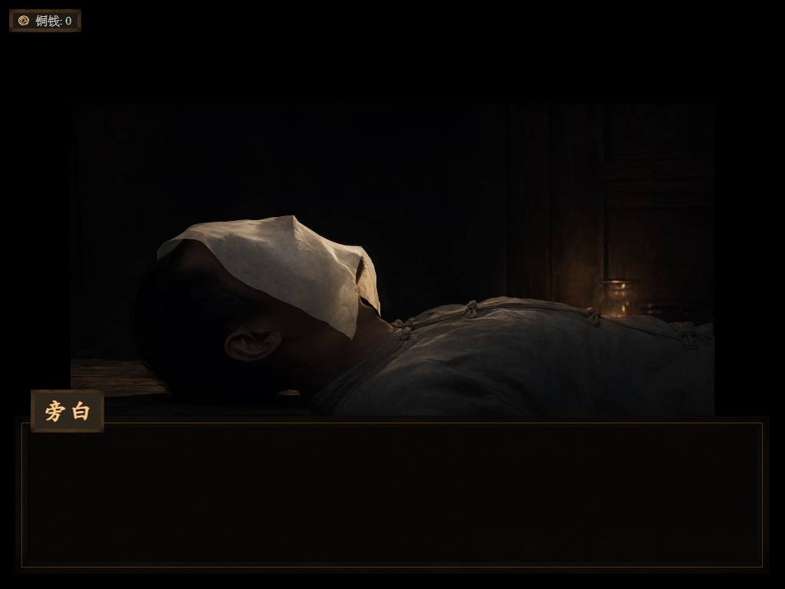

# AX03 · 原生盖脸纸布局与 Hub Qwen 模拟图

状态：[AX03_sim_runtime_layout.png](candidate/AX03_sim_runtime_layout.png) 为**待制作人审查的模拟实机候选**，没有覆盖原 `accepted/AX03_sim.png`。它对应当前 GameDraft 的脸纸过场布局，不是阿秀生平画面；阿秀本人仍不出场。

## 当前运行时证据

在 5173 开发版真实加载 `梦_里屋` 后，通过游戏已有 `graphDialogueManager.startDialogueGraph({graphId:'线外_梦_段D_里屋',entry:'n_cover',npcName:'旁白'})` 触发原生演出，截得 [`梦_里屋_盖脸纸_原生演出_1024x768.png`](../demo_h3_firstframes/runtime_capture/梦_里屋_盖脸纸_原生演出_1024x768.png)。1024×768，SHA256 `5137ea6a52343502672f2cee0ec1d8a716c93e2526ffd55ea9673c449127bcb0`。该帧显示黑底、中央约 82% 宽的近景叠图、左上铜钱 HUD 和下方旁白框；中心影像内有脸纸、关二狗与油灯。**中央矩形边界是游戏真实叠图本身**，不同于旧 F02/AX03 人工拼图造成的错误硬边。

对话图 `n_cover` 先执行 `fadeWorldToBlack` 2000ms，等待 700ms，随后 `showBreathingOverlay` 的 `widthPercent=82`、`xPercent=50`、`yPercent=48`。因此 `candidate/AX03_isometric_sim.png` 所示仍看得见整间屋的盖纸画面，只能供空间和尺度参考，不能当这个运行时瞬间。

原生实机帧：

Hub Qwen 待审模拟图：

## Hub 生图与逐张审查

最终输入仅为上述 **GameDraft 原生运行截图**，Hub 上传文件 ID `d1ba676c-18e5-4b8f-8cd8-fea882c7a671`，上传回执和本地 SHA256 一致。Hub `qwen`（Qwen Image 2.1）采用 `qwen_canvas=explicit`、1024×768、`reference_resolution=0`、40 步；完整请求、幂等键、批次回执、任务结果在 `ax03_runtime_overlay_retry/`。没有把此前 GPT 或 Qwen 图当作参考。

| 候选 | Hub task / 文件 ID | 目检结果 |
| --- | --- | --- |
| `ax03_runtime_overlay_retry/overlay_A.png` | `c7588934-5659-4cb2-8493-e5334edb4de6` / `a4a4cd96-5eba-59ca-ba87-2528afe5ca2c` | 画幅与原生叠图位置基本正确，但脸纸整体略向下、褶皱更大，偏离原人物面部位置；不选。SHA256 `9457d96bbc731422c1b983e174b4ced556e8b576f6fb4aa21ee010a73d217096`。 |
| `candidate/AX03_sim_runtime_layout.png`（原 `overlay_B.png`） | `d72834b5-e3b6-485d-a551-9e45d96841c5` / `08a933b3-2e51-5c75-94ed-1a31586e9976` | 黑底、中央叠图的大小与位置、人物头身、油灯、铜钱 HUD、旁白框均接近原生帧；脸纸仅有细小褶皱变化，无陌生人物、场景或另外贴上的道具板。本轮最可信的“像当前实机”候选，待审。SHA256 `5501b734472c2bf59705f49aec7475c2477d692bbd20ab080b5ee2810cc76c93`。 |

两张下载文件的 SHA256 都与 Hub `result.files[].sha256` 一致。B 图仍由模型轻微重绘了纸、肤色和小字，不应冒称原生截图。若 H3 视频最终选此节点，应在全部图片齐备后，以**原生帧与 B 图**并排确认首帧，再逐帧检验纸的起伏及 UI 漂移。当前未提交 H3。
