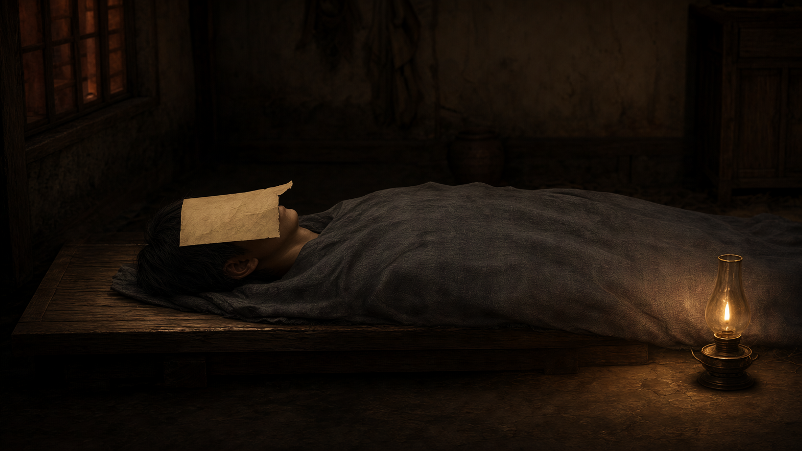
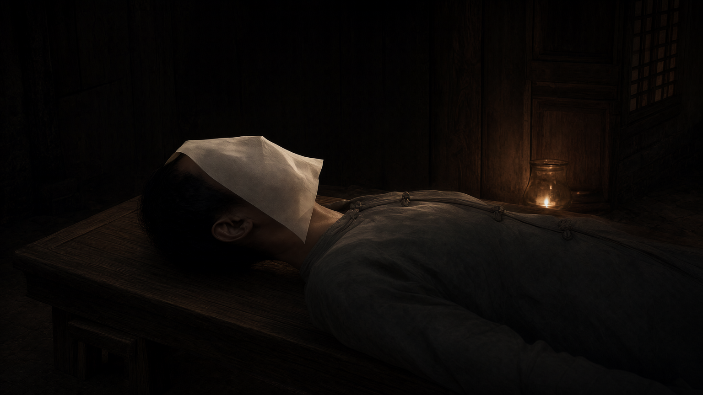

# AX03 概念图脸纸颜色复审

对照 `资料/主线视觉图集_2026-09-25/demo_h3_firstframes/runtime_capture/梦_里屋_盖脸纸_原生演出_1024x768.png`：原生脸纸为白灰/未漂白浅灰，只在油灯照到的边缘略暖。旧 `accepted/AX03_concept.png` 把整张纸画成明显的赭黄；查旧请求，提示词曾写 `yellowed rectangular face paper`，这是明确的提示词偏差，应标记待替换。

本轮只用 GameDraft 当前 `breathing/dream_face_paper` 原始分层无改色合成图及 `梦_里屋/background.png` 原始房间图作 Hub Qwen Image 2.1 输入；没有把此前任何 GPT/Qwen 成品作为参考。请求及幂等键见 `ax03_concept_colorfix_request.json`，批次 `187607bc-f0e5-4871-8f6d-cf228d43f190`，回执见 `ax03_concept_colorfix_submission.json`。两个候选均未覆盖旧图。

| 候选 | Hub 任务 ID | 文件 ID | SHA-256 | 复审 |
|---|---|---|---|---|
| `qa/AX03_concept_colorfix_A.png` | `07527cf7-7f65-415f-b0ac-2ea44ab7a968` | `8232c043-3eba-5558-b105-929dd6cdd0fa` | `b1385247dad75444c455109b01f74b8b573c95fe3cb3cd3fc40243253f430a04` | 纸色回到白灰；仍是较近的低机位，门窗位置较难辨，备用。 |
| `qa/AX03_concept_colorfix_B.png` | `9ff6a6dc-eceb-49b7-b00e-a48b2293f0ba` | `79bf6ddb-9838-545a-a554-6606e29b4e70` | `729ff876337e2ddd4afa4f7fce07c8712598b54cffcb5349eb0ce6f974516bed` | **建议采用**：白灰脸纸仅有灯光暖反射，纸只盖面部、露耳；男主短黑发/灰裹衣、木床、左侧格窗与右侧门板和单盏油灯均与原素材吻合，低机位但人物与床比例可信。 |

两张输出下载时都按 Hub `result.files[].sha256` 计算核验。保留旧图与两张候选，供主图集审定后再替换引用。
