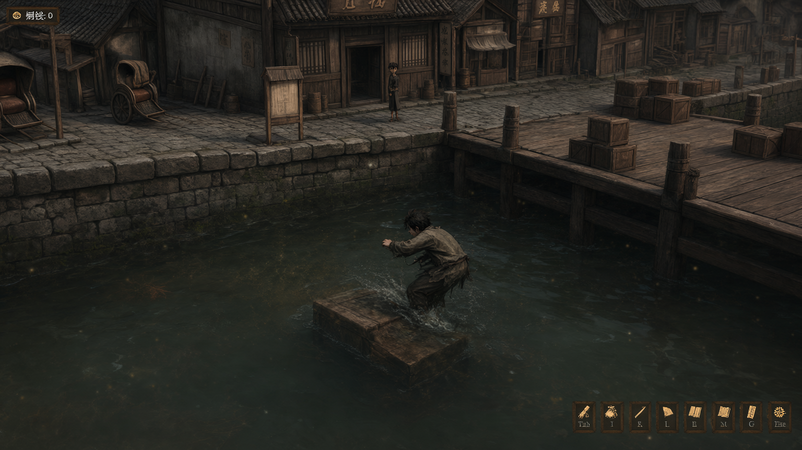
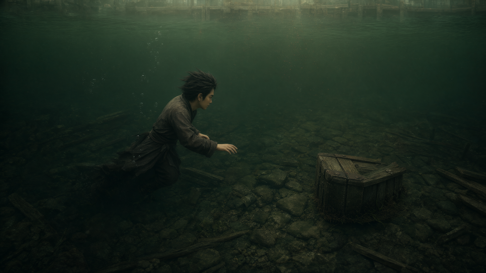
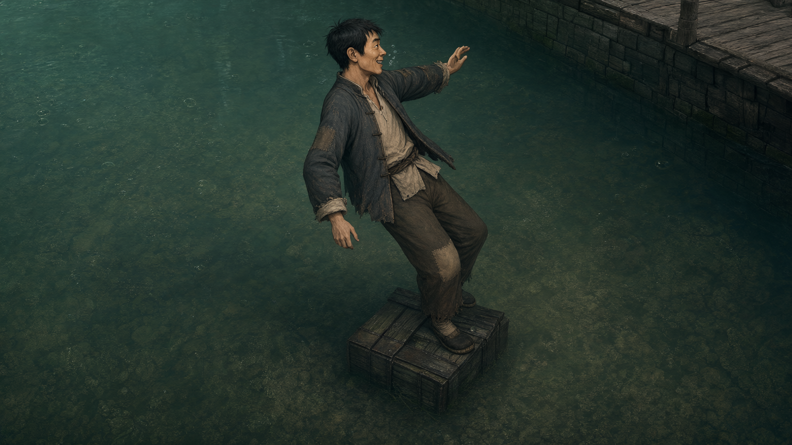
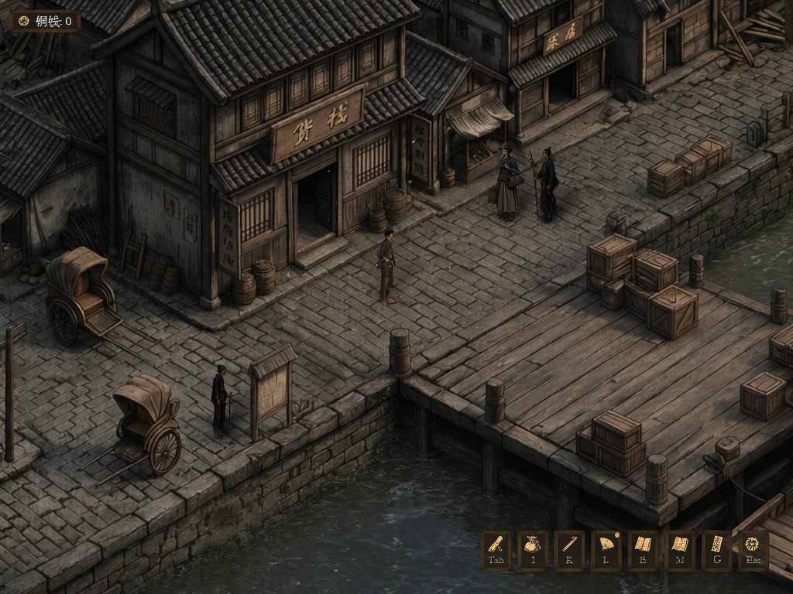

# AX04 码头水下濒死冷信号：独立候选与质检

## 剧情与实现定位

- `Demo制作资料/游戏总纲_设定剧情玩法.md` §九⑥：跳水捞箱的 A 路线在水下摸箱、脚腕或手腕被不明拖拽、接近溺死时，才出现香粉味与死亡系绳；上岸后有抓痕。B 喊价和 C 看热闹没有该遭遇。
- GameDraft `public/assets/dialogues/graphs/线外_寻狗_码头选择.json`：A 路线先 `startWaterMinigame(dock_crate_tutorial)`，返回后播放水下拉拽音效，旁白说“摸到箱子那一刻——脚腕猛地被拽了一下”，随即 `a_4` 播 `axiu_faint`；下一节点才显示抓痕，再下一节点才说侥幸上岸。故这不是选项文字一出现就播放的 cue，而是水下濒死事件的后置演出。
- `public/assets/data/signal_cues.json`：`axiu_faint` 是屏幕中心 x=50%、y=46%、宽=26% 的 `axiu_cue` 淡微尘叠层，持续 1400ms，然后隐藏；没有阿秀人形。`axiu_cue` 原图是 `public/resources/runtime/images/ui_vfx/axiu_signal_glow.png`。
- **已核的原生画面边界：** 同级 `../runtime_capture/码头跳水_a4_axiu_faint_原生播放_无通知_1024x768.png` 是 GameDraft 自己在 `a_4` 播 cue 的 1024×768 截帧，SHA256 `0f99ba55e9997d7384f46af5fe0668af88f883ff050627ef982b32d9da704faf`。运行态 `scene=码头白天`、`dialogue=a_4`、`minigame.active=false`；微尘叠在**码头主场**，没有水下小游戏画框或黑检视板。关二狗约 95 像素高、五码头人物同屏。原生抓帧通过小游戏的 Esc 退出续到 `a_4`，没有证明成功捞箱的整条连续玩法；准确取证路径见 `../runtime_capture/码头跳水_axiu_faint_取证.md`。

## Hub Qwen Image 2.1 电影概念候选

本轮只上传 GameDraft 的原始码头实机截图、原始码头背景、`dock_crate_tutorial` 原始河床/沉箱角图、关二狗 `player_hero.png`；来源 ID 和 SHA256 见 `ax04_source_uploads.json`。没有使用此前任何 GPT/Qwen 成品输入。所有请求经 `httpx.Client(trust_env=False)` 直连 `http://denghong01:8765/`。

| 候选 | Hub 任务 ID | Hub 文件 ID | SHA256 | 审查 |
|---|---|---|---|---|
| `AX04_concept_try1.png` | `7e7f1011-1d7b-4696-b16e-6c230ea1212d` | `47e4f273-f0b6-501b-b95a-66f767202eff` | `76a10440f41511c727b67d53d348aac8e7e2c7bfccd14cddd4ea39617e08859f` | **判退**：生成成岸上俯视 HUD 图，男主比例过大，箱子浮在水面而非水下，错过濒死瞬间。 |
| `AX04_concept_try2.png` | `26982616-4d8f-4049-b449-62b1c53a567c` | `8ecc48db-6856-51e7-b080-bd7361f289c1` | `d23f87a00d754efc29584c003ee1ad15c5e27e5117285c7c3fb5adf6e9a45148` | **空间/造型合格，剧情瞬间判退**：河床、沉箱、成人尺度及衣着相符，但关二狗姿态近乎平静伸手摸箱，未表现骤然下坠与溺亡临界。 |
| `AX04_concept_try3.png` | `8058debb-d7e4-4e6d-b451-f77134904d60` | `d8ba189d-8bcc-5426-a5ce-4db11c0c1cc4` | `02def786dd6542c8141e5d9dbdacbe5c0f157fd09fb9dc9c071bd19f1cb100ad` | **动作与物理比例通过，角色身份复审判退**：失衡、沉箱尺度和场景成立，但衣服被简化成整件深色衣；原高清关二狗 ref 的敞开灰蓝外褂、浅色内衫、袖口及补丁没有可靠保留。不得当正式电影图。 |

三张均逐张查看并对照原河床、沉箱和角色 ref；下载时与 Hub `result.files[].sha256` 核对。具体请求和幂等键见 `ax04_concept_request.json`、`ax04_concept_try2_request.json`、`ax04_concept_try3_request.json`，提交回执与下载审计另存同目录。没有把先前候选作为后续输入。

2026-09-25 追加身份复审：之前上传的 `player_hero.png` 是较小的游戏精灵，虽然逐张看过高清角色 ref，**没有把该高清 ref 送进 try3 请求**；只在提示词中概括“灰棕破衣”导致模型删掉了角色识别衣层。已将 GameDraft 原始 `character_setup_refs/player_anim__guan_ergou_normal_ref.png` 直传 Hub（file ID `f70500fa-22ba-48f9-9165-bc4883ce294e`，SHA256 `e7b67c746a45fd50a013a65698a4e0b1a8a9d4455e281fa6546af6a5ab16395d`），以 `<image1>` 明确身份与衣服职责。重抽请求、批次和两张任务记录见 `ax04_identity_ref_request.json`、`ax04_identity_ref_submission.json`。新图未复审前，本节点的电影图为空缺。

重抽 A `AX04_concept_identity_A.png`：Hub 任务 `c5eddeb0-d699-4156-b7ab-e5b95bd94a25`，文件 ID `56c2e6d3-dec4-56c1-89ca-623cd5a47618`，SHA256 `594e5ac3ce2d4db73845bd68fa8a990388f58a73c34a65c2a1152ac413b33e39`，下载哈希已核。**判退**：外褂、浅色内衫和补丁明显更接近 ref，人物却保持 ref 的笑脸，双脚踩在沉箱上像在站立，没有溺水与骤然下拽；箱子也从原本破开的沉箱变成完整大木箱。身份改进不能替代剧情验收。

## Hub Qwen Image 2.1 模拟实机候选

模拟图均以**原生无通知 a_4 截帧**为唯一输入主画布，用 Hub Qwen Image 2.1 重新生成；没有输入电影候选或任何以往 GPT/Qwen 成品。原机位中码头仓房、石岸、木栈桥、货箱、水面和小人物的位置均是验收基准：关二狗约 x512、y287–383，高约 96 像素；另四名现有 NPC 分别在告示旁 x413、下方黄包车旁 x286、上方靠河 x657 和 x713。微尘应只在中心人物附近短暂轻掠，主画面不呈水下小游戏。

| 候选 | Hub 任务 ID | Hub 文件 ID | SHA256 | 审查 |
|---|---|---|---|---|
| `AX04_sim_try1.png` | `4d639366-13ff-4d08-bc82-db1774708ff0` | `5622d5b2-c3ba-5fde-a6c4-96962719a95e` | `0610442dcc9422320afc2f2acdc2c5b77bba844a89c0e790244cb912e30ad636` | **判退**：人物高度与场景比例近原机，但漏掉告示旁 x413 的黑衣 NPC。 |
| `AX04_sim_try2.png` | `ddb13a5f-a3c3-49f9-adc0-9b4c622b2082` | `3595e60f-7513-58b3-a5ed-89f6d0f7154b` | `ac22afb07b7b92c99eb9cd3ab018293d5735b7065a2fdd100b9bf64807d9efd8` | **模拟候选通过**：1024×768 俯斜码头同机位，五位原人物均在且无新增；关二狗约 93–96 像素，告示、仓房、栈桥、黄包车和货箱位置与原生帧相近；黄白微尘非常轻，未画水下框或黑板。字样近似即可，不作文字验收。 |

请求、幂等键、任务回执和 SHA256 下载审计分别保存在 `ax04_sim_request.json`、`ax04_sim_try2_request.json` 及对应 submission/download audit JSON。两张输出都未覆盖任何 `accepted/` 成品，待主图集审定。

