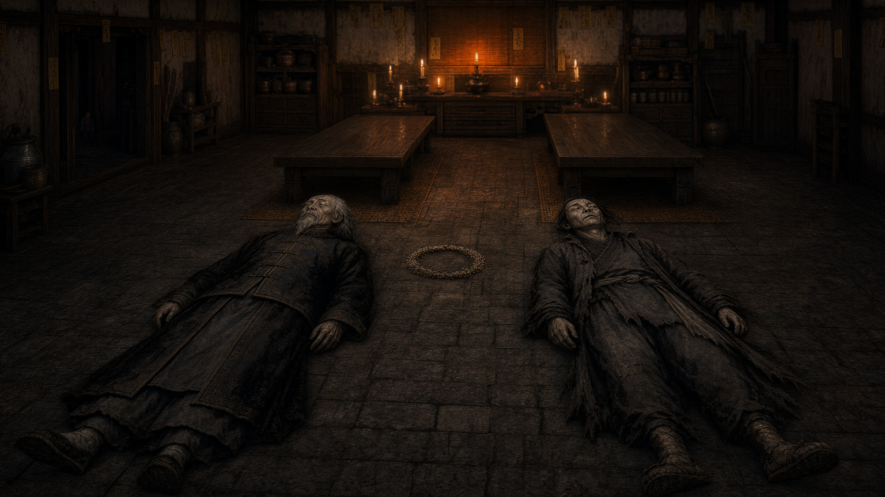
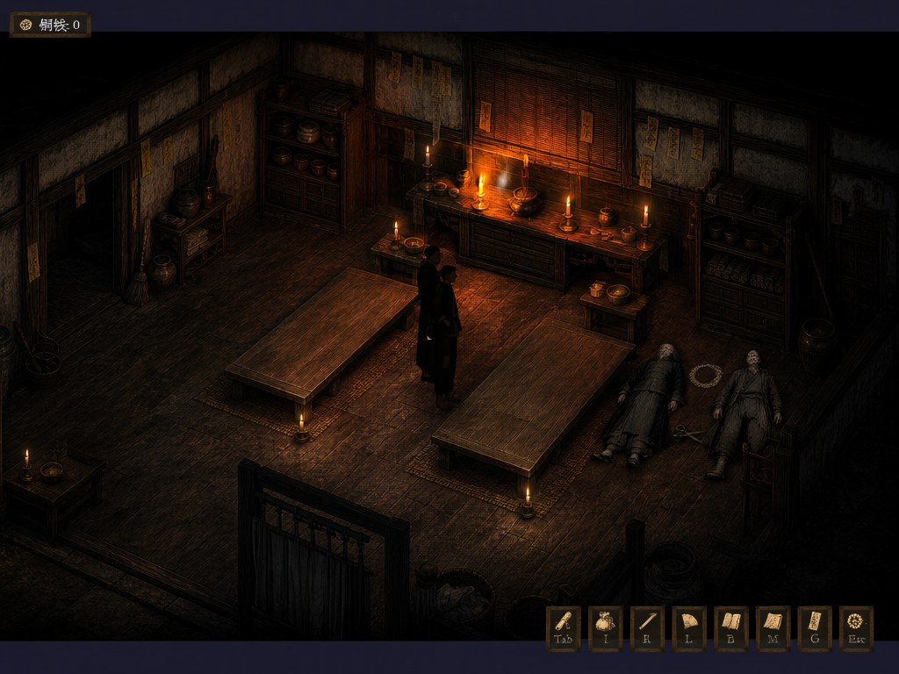
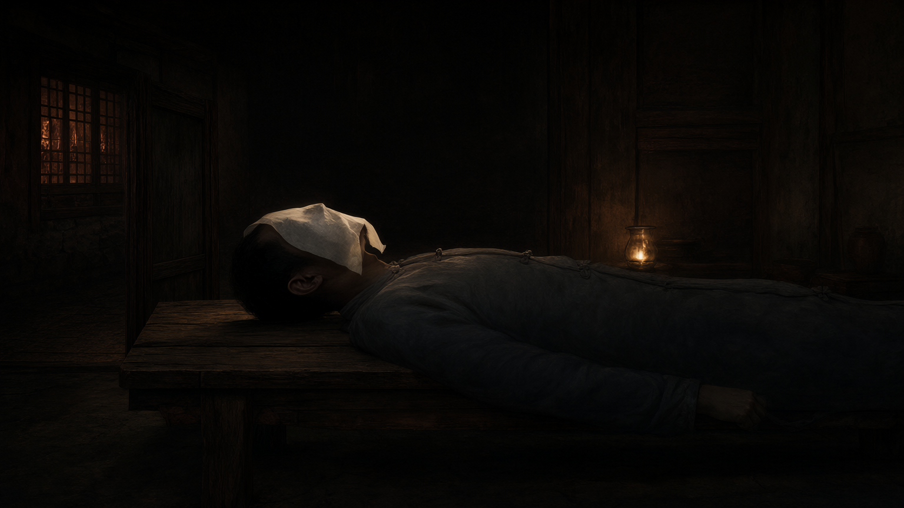
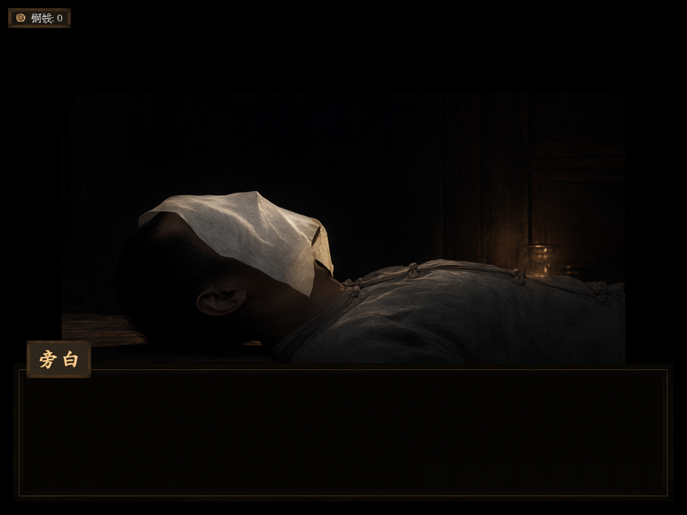
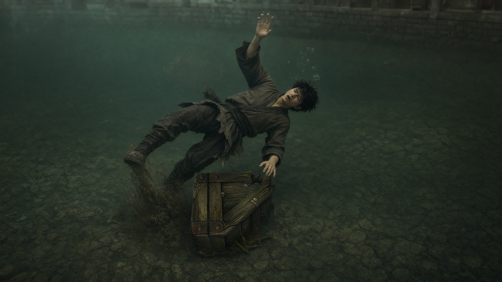
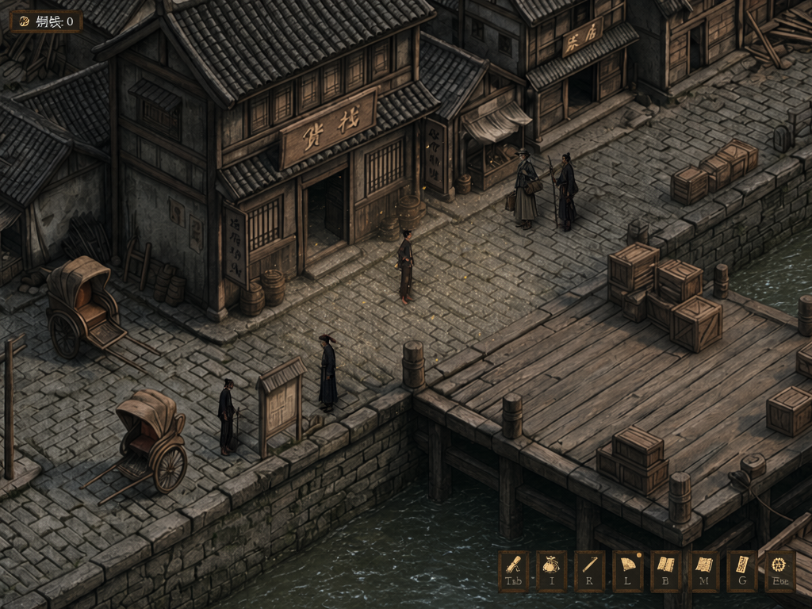

# 阿秀暗线：现有实机场景可支持的画面

本组是 Hub Qwen Image 2.1 基于 GameDraft **原始资产与原始实机截图**独立生成的概念和模拟实机画面。阿秀本人不出镜；她的生平地点与角色 ref 缺失情况见 [质检与范围](质检与范围.md)。图集按[总纲与当前演出对账](../阿秀信号正典对账.md)筛选：AX01 城隍庙“阿秀灯火信号”解释已撤回；AX03 两张当前版式图仍待审。

## AX02 义庄·两尸松手后的冷信号

## AX03 梦里屋·纸停后的小调

AX03 右图以 GameDraft 当前 `n_cover` 原生运行帧为来源，黑底中央约 82% 宽脸纸画框与游戏布局一致；两图均为候选，旧赭黄脸纸概念和全屏效果提案保留在[质检记录](质检与范围.md)，不占本页正典展示位。

## AX04 码头跳水濒死·香粉冷信号（待审候选）

电影图依总纲表现水下濒死；GameDraft 的 `a_4` cue 实际在小游戏撤离后显示于码头白天主场，所以模拟图采用[真实 a_4 原生帧](runtime_capture/码头跳水_a4_axiu_faint_原生播放_无通知_1024x768.png)的五人小比例、仓房、栈桥与微尘版式。两图的独立 Hub 来源、判退版本和 SHA256 见[AX04 质检](ax04_candidate/AX04_独立候选与质检.md)。

## 已撤回：AX01 城隍庙夜

[原电影图](accepted/AX01_concept.png)与[原模拟图](accepted/AX01_sim.png)仍供来源与尺寸审计。总纲 §十明确城隍庙没有香粉味，关二狗的恻隐不是阿秀回应；本节点不计阿秀正式图组。
