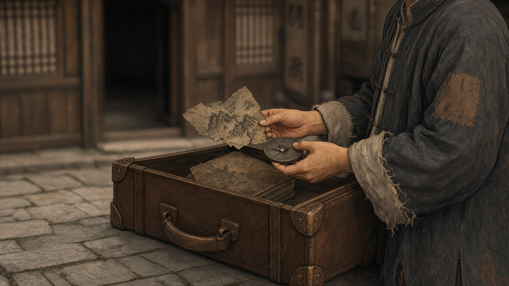
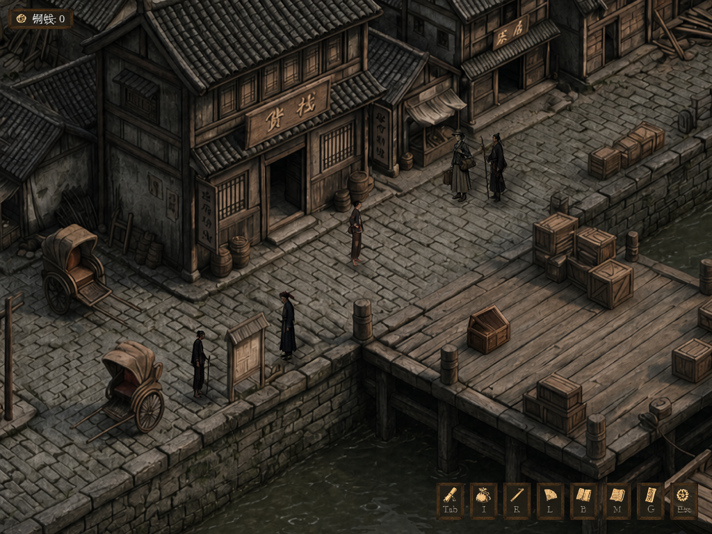

# F02 · 码头开箱，神仙顶地图线索

此节点是正式版进山主线的 Demo 前置线索。图片由 Hub Qwen-Image-2.1 使用 **GameDraft 原始场景、实机截图、角色和道具 ref** 独立生成；模拟实机图不是游戏实际运行画面。旧 GPT/Qwen 成品没有用于参考。

## 电影视角概念图

采用电影物件近景，关二狗的衣袖、双手与原木箱同框，用手掌直接检验地图和罗盘尺度；背后是原货栈门与格窗的虚化局部。头部留在画外，属于有意的近景取景。早一批候选因扩出实机画面外的大船而撤回；随后局部货栈宽镜头虽然没有新场景，却把蹲下的人画得相对门洞过大，复审判退。新的两张宽镜头又分别沿用俯视机位、人物相对门偏大，均未入选。

## 4:3 模拟实机

以原实机截图作为画布，圈出局部编辑范围后由 Hub Qwen 2.1 生成。圈线只用于输入标记，成品已擦除。开盖箱落在圈定范围内，明显低于人物；没有黑色检视弹层或套贴边框。箱内地图细节在这个俯斜实机机位中不可辨，画面表现的是打开箱子的瞬间，地图线索由随后原游戏检视流程揭示。旧版比例过大的箱子和黑色矩形弹层均已判退，不能送 H3。

逐张判退、Hub 任务和 SHA256 见 [质检与来源](F02_质检与来源.md)。
