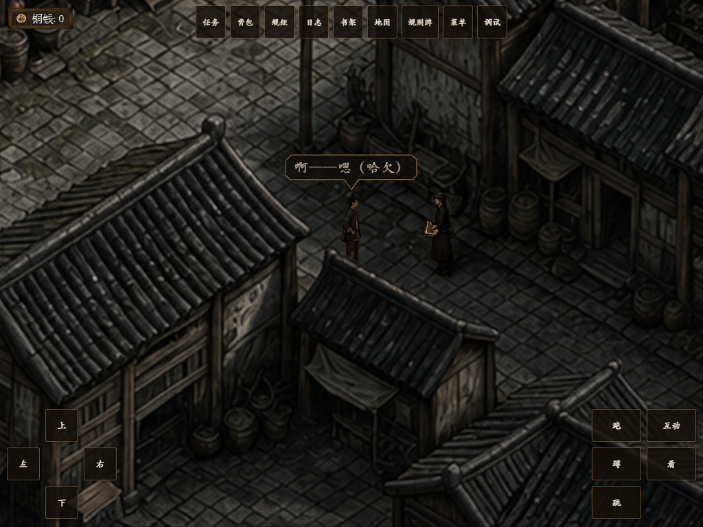
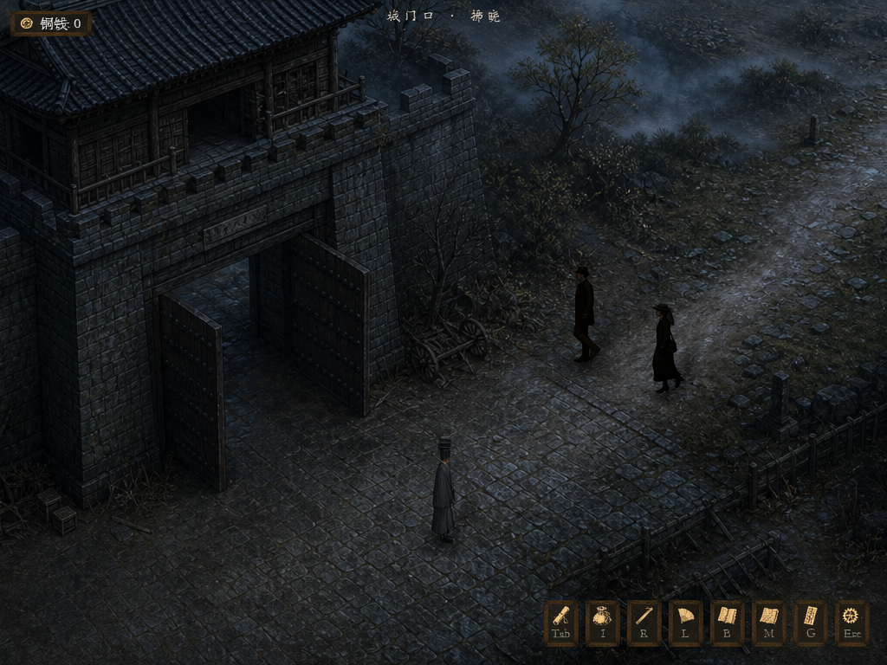

# 正式版与阿秀线 · Hub Qwen Image 2.1 独立生成

本轮只使用 `http://denghong01:8765/` 的 Qwen Image 2.1 生成图片。输入来自 GameDraft 原始场景、角色素材和实机截图；**没有把此前 GPT Image 或 Qwen 图集成品当作参考**。模拟实机图是生成图，不是运行时截图。

## 复审后的候选画面

制作人指出人物比例和整图套贴问题后，旧 F02、AX03 模拟图已撤回并保留在 `rejected_after_reaudit/`。F02 经圈选局部编辑重做，木箱保持小尺度并通过本轮复审。AX03 进一步取得了游戏**原生运行时盖脸纸帧**，并由 Hub Qwen 生成符合当前黑底、82% 叠图版式的待审模拟图；此前全屏画面保留为效果提案。复核总纲后，AX01 的“阿秀灯火信号”解释与城隍庙段正典冲突，已从下表撤回，见[信号正典对账](阿秀信号正典对账.md)。下表是仍符合现有证据的候选图，不等于正式版与阿秀生平全部完成；H3 视频首帧须另行逐张确认。

| 范围 | 电影视角概念图 | 模拟实机图 | 依据与质检 |
| --- | --- | --- | --- |
| F01 城门出发，正式版进山前的衔接 |  |  | [城门场景与人物比例核查](formal_early/范围与证据.md) |
| F02 码头捞箱，随后揭出神仙顶地图线索；电影物件近景 |  |  | [码头原场景、道具与人物比例核查](formal_late/F02_质检与来源.md) |
| AX02 义庄两尸松手，阿秀冷信号余韵 |  |  | [义庄原演出与米圈核查](axiu_bio/质检与范围.md) |
| AX03 梦里屋纸停后，远处小调初现；两图均为待审修正候选 |  |  | [概念图脸纸颜色复审](axiu_bio/AX03_概念图复审.md)；[原生运行帧与 Hub 输出逐张对照](axiu_bio/AX03_原生叠图对照质检.md) |
| AX04 码头跳水濒死，香粉冷信号；电影图重审中 | 旧电影候选因关二狗衣着与高清 ref 不符撤回，待 Hub 角色 ref 重抽图复审 |  | [a_4 原生截帧、Hub 任务与逐张质检](axiu_bio/ax04_candidate/AX04_独立候选与质检.md)：旧电影图动作和箱子比例合格，但角色衣层不合格；模拟图按原生 cue 时点的码头机位与五人小比例。 |

F01 概念图为地面人眼机位，只见关二狗；克拉拉和埃德加在画外。F01 模拟图保持原项目俯斜机位和三人小比例。F02 是 Demo 中指向正式版神仙顶的地图线索，不是正式版进山实景。AX02–AX04 是阿秀**暗线氛围**，阿秀本人不在画面中；它们不等于阿秀生平已出图。AX01 两张原图保留在[历史质检记录](axiu_bio/质检与范围.md)供审计，**不计入正典阿秀图组**。

AX03 的[旧全屏效果提案](axiu_bio/accepted/AX03_sim.png)与从原场景独立生成的[场内俯斜镜头候选](axiu_bio/candidate/AX03_isometric_sim.png)均继续留存；二者不是当前黑底 82% 叠图的原始实机帧。场内候选把纸与仍可见的屋内景混在一个画面，**只能供空间与尺度审查，不能当实际盖纸演出或 H3 首帧**。旧[电影概念图](axiu_bio/accepted/AX03_concept.png)把游戏原本白灰的脸纸画成赭黄，已降级待替换；新概念候选只用 GameDraft 原始素材在 Hub 重抽。新模拟候选、原生实机来源与判退 A 图见[AX03 原生叠图质检](axiu_bio/AX03_原生叠图对照质检.md)。

生成方法、旧图失效根因、Hub 控制实验与逐张 QA 见 [Qwen Image 2.1 用法复盘](Qwen21用法复盘与校准.md)。

## Demo 视频首帧的新增候选

这两张不增加正式版或阿秀生平的已完成节点，只用于后续 Demo 视频的首帧审查；均为 Hub Qwen 模拟图，未提交 H3。

| 事件 | 待审候选 | 与实机比对 |
| --- | --- | --- |
| V21 克拉拉街角招募 |  | 已取得[当前 GameDraft 原生招募对白同框帧](demo_h3_firstframes/runtime_capture/V21_克拉拉招募_原生对白同框_1024x768.png)：角色、机位和大小以此为准，台词提到笔记本但手上没有实物。Qwen 候选有开发按钮和无关气泡，只作额外构想，未通过 H3 首帧验收；判退过程见[V21 逐张质检](demo_h3_firstframes/v21_clara/V21_克拉拉招募质检.md)。 |
| V22 城门终幕换装 |  | [城门 V22 质检](demo_h3_firstframes/candidate/citygate_v22/城门V22质检.md)：Qwen 候选人物比原图高约一成，降为次级候选；现已捕获[原生换装前帧](demo_h3_firstframes/runtime_capture/城门V22_换装前_原生基准_1024x768.png)及[原生换装后帧](demo_h3_firstframes/runtime_capture/城门V22_假道士_原生换装_配对_1024x768.png)，后者作为 H3 首帧的比例基准。 |

## 暂缺节点

正式版进山寻找阴石、阴石取走、桃溪鬼村、月娘铺及终章山口目前没有相应 GameDraft 已实现场景；阿秀本人没有项目角色 ref，绣房、桃溪与终章山口也没有原始实机参照。现行总纲还明确正式版逐关顺序未定稿。因此这些节点无法同时满足“只用现有场景和角色”与“每节点提供可信模拟实机”两项要求，本轮没有用其他地图或女子形象冒充。逐节点证据见 [正式版中后段资产核查](formal_late/资产核查与暂缺节点.md)和[阿秀生平 B01–B08 素材门槛](axiu_bio/质检与范围.md#阿秀生平逐段素材门槛)。另有[AX05 山口信号核查](axiu_forest/AX05_核查说明.md)：游戏的香粉浮层与正典李天狗压灭它的时点错位，未据此生图。

## 后续 Demo 视频

已核对 Hub 的 MiniMax H3 能力并建立[Demo 流程视频片段规划](Demo视频片段规划.md)。按制作人要求，待全部图片齐备、验收后再提交视频任务；目前没有 H3 视频成品。
